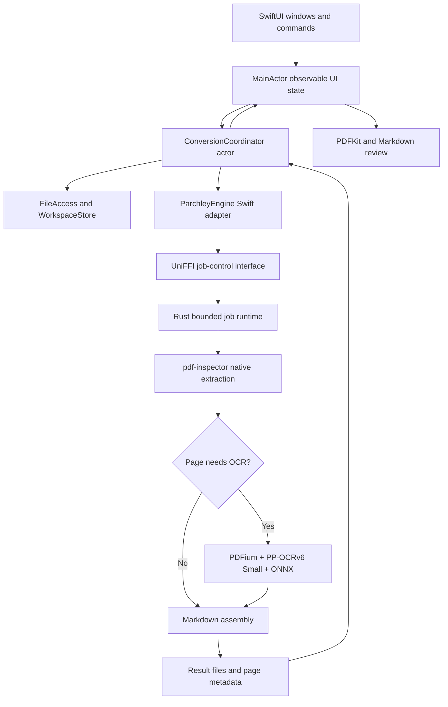

# Parchley implementation plan

Native PDF-to-Markdown for macOS 26 and later

Prepared September 6, 2026. This is the original planning record. The app is
now implemented in the SwiftUI, Swift package, and Rust sources in this
repository. Use `README.md` and `Docs/Release.md` for the current build and
release process.

## 1. Product direction

Parchley lets someone drop in a PDF, convert it locally, compare the result with the original, make small corrections, and save Markdown. The app should feel like a small Mac utility: quick to open, quiet while working, and clear when a page needs attention.

Use SwiftUI for the interface, Liquid Glass for appropriate controls, Swift Concurrency for application coordination, and Rust for PDF processing. Use Firecrawl's pdf-inspector as the conversion dependency. Optional local OCR makes scanned pages readable.

### Proposed release scope

- Minimum OS: macOS 26.0. Build with a stable Xcode release containing the macOS 26 SDK or later.
- Initial supported architecture: Apple Silicon, arm64. This is a proposed scope choice, not a requirement imposed by SwiftUI. Intel support needs its own OCR runtime build and validation before advertising it.
- Distribution: sandboxed, Developer ID-signed and notarized app distributed in a DMG. Keep the architecture suitable for a later Mac App Store release.
- No account, server, subscription infrastructure, document upload, or cloud fallback in version 1.
- Native-text conversion and local OCR both belong in the finished version 1. Deliver native-text conversion first as an internal milestone.
- Documents remain on the Mac. The optional OCR model download requires a connection once; document conversion works offline afterward.
- English interface initially, using String Catalogs from the start. OCR language coverage is a separate question and must be tested before making language claims.

The name, bundle identifier, signing team, pricing, and distribution domain need final product-owner values before release. Use a development-only bundle identifier until those values are supplied. Name and trademark availability have not been checked.

### Version 1 features


| Area            | Required behavior                                                  |
| --------------- | ------------------------------------------------------------------ |
| Import          | Open dialog, drag and drop, Finder Open With, multiple PDFs        |
| Conversion      | Automatic native-text extraction with optional selective OCR       |
| Queue           | Per-document status, cancel, retry, remove, stable ordering        |
| Review          | PDF preview, Markdown source editor, rendered Markdown preview     |
| Correction      | Edit Markdown, undo/redo, find text, track unsaved changes         |
| Export          | Save UTF-8 `.md`, copy Markdown, batch export to a selected folder |
| Transparency    | Pages needing attention, conversion method, actionable errors      |
| Settings        | OCR download/removal, conversion defaults, history retention       |
| Recovery        | Restore completed work and drafts; mark interrupted jobs honestly  |
| Mac integration | Menus, shortcuts, resizable panes, appearance and accessibility    |


Defer PDF editing, OCR handwriting promises, image extraction, chat with documents, LaTeX recovery, cloud sync, folder watching, Shortcuts integration, and iOS. Embedded pictures are not automatically converted into reusable Markdown assets in version 1.

## 2. Verified dependency facts and uncertainties

The following facts were checked online. Everything described later as a design, budget, or target is proposed Parchley behavior, not a claim that the dependency already implements it.


| Dependency                  | Verified fact                                                          | Planning consequence                                                 |
| --------------------------- | ---------------------------------------------------------------------- | -------------------------------------------------------------------- |
| pdf-inspector               | Rust parser with Markdown output and optional OCR                      | Integrate the Rust library directly; avoid shipping Node or Python   |
| Current repository manifest | Reports version 1.17.0; default features are empty                     | Pin a tested release or commit and its lockfile, not floating `main` |
| OCR                         | PP-OCRv6 Small through OAR and ONNX Runtime                            | Package the runtime libraries and manage model data separately       |
| Model files                 | Detection model, recognition model, dictionary total about 31 MB       | Show a measured download size in the finished UI                     |
| macOS OCR                   | Upstream describes the external-runtime path as preview                | A signed macOS end-to-end spike is a release dependency              |
| Intel OCR                   | The documented ONNX Runtime release lacks an Intel macOS archive       | Apple Silicon first; do not claim Intel OCR support                  |
| UniFFI                      | Swift bindings exist; documentation warns of Swift 6 async rough edges | Start with short synchronous job-control calls across FFI            |
| Tokio                       | Started `spawn_blocking` work cannot be stopped with `abort()`         | Cancellation needs explicit design and realistic UI wording          |


Sources: [parser repository](https://github.com/firecrawl/pdf-inspector), [Cargo manifest](https://github.com/firecrawl/pdf-inspector/blob/main/Cargo.toml), \[OCR runtime guide\](https://github.com/firecrawl/pdf-inspector/blob/main/docs/ocr-runtime.md), [UniFFI Swift support](https://mozilla.github.io/uniffi-rs/latest/swift/overview.html), [Tokio blocking tasks](https://docs.rs/tokio/latest/tokio/task/fn.spawn_blocking.html).

### Skills and engineering guidance applied

This plan uses the installed SwiftUI Expert, Swift Concurrency, Rust Async Patterns, and Unslop skills. SwiftUI references include modern APIs, Liquid Glass, and macOS window behavior. Swift concurrency guidance informs isolation, task ownership, and cancellation. Rust async guidance informs bounded jobs, channels, and blocking-work separation.

There is no existing Parchley project to inspect. The compiler settings below are deliberate proposed settings, not inferred settings of an existing project. Confirm the actual generated Xcode and Swift package settings in milestone 0. Skill examples aimed at iOS must be checked against the macOS SDK before use.

## 3. Architecture



### Responsibility boundaries


| Component                           | Owns                                                           | Must not own                                            |
| ----------------------------------- | -------------------------------------------------------------- | ------------------------------------------------------- |
| App model, `@MainActor @Observable` | Selection, sheets, visible job snapshots, editor state         | PDF parsing, model verification, blocking disk access   |
| `ConversionCoordinator` actor       | Queue order, attempt IDs, transitions, cancellation requests   | SwiftUI views or raw PDFKit objects                     |
| `FileAccess` service                | User-selected URL access, staging copies, bookmarks            | Conversion algorithms                                   |
| `WorkspaceStore` actor              | Versioned history, draft locations, atomic metadata writes     | View state or engine internals                          |
| `OCRModelManager` actor             | URLSession download, integrity checks, installation state      | Downloading executable libraries at runtime             |
| `ParchleyEngine` adapter            | Typed bridge calls, Sendable snapshots, error mapping          | SwiftUI imports or user-facing strings                  |
| Rust core                           | Parsing, OCR execution, conversion results, resource ownership | App sandbox grants, dialogs, export destination choices |
| Preview wrappers                    | PDF display and rendered Markdown                              | Executing document-supplied code                        |


Keep one in-process Rust engine for version 1. This is simpler to package, but native library crashes can terminate the app. The resilience milestone must test malformed inputs. If hard cancellation or crash isolation becomes a release requirement, move this same engine behind a bundled XPC service before release; do not pretend in-process FFI provides isolation.

## 4. User experience and Liquid Glass

### Main window

Use `WindowGroup`, native commands, and a `Settings` scene. Default to approximately 1,180 × 780 points with a practical minimum around 850 × 560, adjusted after testing at large text sizes.

Use a `NavigationSplitView` sidebar for imported documents. The detail area contains a resizable split between PDF and Markdown. Use an AppKit split view bridge only if native layout cannot provide the required resizing behavior. An optional inspector shows page count, conversion method, warnings, and file details.

The Markdown pane has Source and Preview modes. Switching modes preserves selection and scroll position where feasible. Do not implement pixel-perfect synchronized PDF/Markdown scrolling in version 1. Page-based navigation is enough where trustworthy page metadata exists.

Toolbar actions: Add PDFs, Convert or Cancel, Copy Markdown, Export, Inspector. Disable actions by actual state. Show explanatory help for disabled export when no result exists.

### Visual direction

- Use standard macOS 26 toolbar and navigation styling first. These system controls adopt the platform design.
- Use custom `glassEffect` only for a compact floating action group if it materially improves the layout. Group related custom glass elements with `GlassEffectContainer`.
- Keep PDF pages and Markdown text on readable document surfaces. Avoid glass behind body text, editor backgrounds, and every queue row.
- Apply custom glass after padding and sizing. Do not stack redundant custom glass on standard glass controls.
- Use semantic colors, system typography, SF Symbols, and a restrained accent color. Do not hardcode white backgrounds or unreadable low-opacity text.
- Respect Reduce Transparency, Increase Contrast, and Reduce Motion. Replace custom translucent surfaces with readable system backgrounds when needed; avoid decorative morphing in reduced-motion mode.
- macOS 26 is the deployment floor, so supported macOS 26 APIs do not need older-OS branches. Gate any API introduced after that floor. Verify the actual macOS API signature in the chosen SDK.

Apple reference: [Applying Liquid Glass to custom views](https://developer.apple.com/documentation/SwiftUI/Applying-Liquid-Glass-to-custom-views).

### Document states


| State              | What the user sees                             | Available action                        |
| ------------------ | ---------------------------------------------- | --------------------------------------- |
| Empty              | Drop a PDF or choose files                     | Add PDFs                                |
| Queued             | Waiting                                        | Remove, move earlier                    |
| Preparing          | Opening document                               | Cancel                                  |
| Password required  | Password field for this PDF                    | Unlock, cancel                          |
| OCR model required | Download size and local-processing explanation | Download and continue, skip OCR, cancel |
| Converting         | Stage label; page progress only when available | Cancel                                  |
| Cancelling         | Stopping after the current operation           | Wait; preserve other results            |
| Completed          | Markdown available                             | Review, edit, copy, export              |
| Needs review       | Result available with page-specific warnings   | Review affected pages, export           |
| Failed             | Specific reason and recovery action            | Retry, choose another file              |
| Interrupted        | Previous conversion did not finish             | Retry                                   |


Examples of plain user-facing errors: “This PDF needs a password.” “Page 8 could not be read clearly.” “The OCR download was interrupted. Try again.” Keep backend names in diagnostics, not the normal flow.

### Keyboard and accessibility

Implement Command-O to import, Command-S to save the current Markdown draft/export, Command-Shift-S for Save As, Command-F for editor find, and Command-comma for Settings. Standard Command-C copies the current text selection. Provide a separate Copy Markdown command rather than hijacking normal copy. Route menu actions to the focused window.

Every control needs an accessible label and keyboard operation. Announce major conversion state changes, not every progress tick. Test sidebar identity, focus restoration after sheets, PDF preview access, editor selection, and warning navigation with VoiceOver. Never use color alone to communicate failure.

## 5. Import, file access, and local storage

### Import sequence

1. Accept URLs through a PDF-only file importer, drag and drop, and Finder open events.
2. Validate file type and parser readability; do not trust the extension alone.
3. Acquire the security-scoped access required for user-selected files.
4. Copy the input to a job-specific private staging directory off the main actor. Hash while copying if practical. This produces a stable conversion snapshot even if the original changes.
5. Release the original security scope after staging, unless a live original preview still requires it. Preview the staged copy by default to keep lifetimes simple.
6. Pass the private staged path to Rust. Never pass a URL string and assume Rust gained sandbox permission.
7. Preserve the original PDF. Export cannot overwrite the input.

For an iCloud placeholder or unavailable network volume, keep preparation cancellable and show a specific availability error. An alias, inaccessible file, huge file, or malformed PDF must not silently disappear from the queue.

Bookmarks are useful for reopening an original later. Store them only for retained history, resolve staleness, and ask the user to reselect unavailable originals. Balance every successful security-scoped start with a stop on success, failure, and cancellation. [Apple sandbox file guidance](https://developer.apple.com/documentation/security/accessing-files-from-the-macos-app-sandbox).

### Storage layout

Use Foundation directory APIs inside the app container, not literal home-directory paths:

```text
Application Support/Parchley/
  workspace.json                 # schema-versioned job and history metadata
  Results/<document-id>/         # completed Markdown and result metadata
  Drafts/<document-id>/           # user edits and draft revision
  Models/<manifest-revision>/    # verified optional OCR data
Caches/Parchley/
  Jobs/<attempt-id>/             # staged input and scratch output
  Preview/                       # bounded regenerable preview data
```

Model storage is in Application Support so a promised offline installation is durable. Configure the Rust model directory explicitly. Exclude re-downloadable models and scratch files from backup; do not exclude valuable edited drafts by default.

Use versioned Codable JSON and separate Markdown files for the first release. A small conversion history does not require Core Data or SwiftData. Serialize writes through `WorkspaceStore`, write a temporary file, then atomically replace the previous file. Preserve a last-known-good metadata copy for recovery.

Default proposal: retain the last 20 completed results for 30 days; remove source staging after conversion/review ends and remove temporary raster images immediately after use. Explain history retention in Settings and provide Clear History. Never purge unsaved user edits under automatic retention. Restart recovers drafts but marks active attempts Interrupted; it does not invent resumable OCR checkpoints.

## 6. Swift–Rust interface

### Baseline bridge choice

Use UniFFI to generate records, typed errors, and short job-control methods. Package the Rust static library in a local XCFramework with a Swift package wrapper. Do not depend on Homebrew, a system Python, or a user-installed CLI.

Avoid exported Rust futures in the first bridge. UniFFI documents incomplete Swift 6 async support. Swift can still provide an async API over bounded, nonblocking bridge operations. Validate generation and strict concurrency in milestone 0. [UniFFI Swift documentation](https://mozilla.github.io/uniffi-rs/latest/swift/overview.html).

If the generated synchronous interface cannot compile cleanly under the selected toolchain, use a narrow C ABI with opaque handles as a scoped fallback. Document ownership and buffer-freeing functions; do not scatter unsafe pointers through the UI. Do not silence all Swift concurrency checks to make generated code compile.

### Proposed interface contract

These names describe a new Parchley wrapper; they are not existing pdf-inspector functions:

```text
Engine.start(JobRequest) -> JobHandle             # fast admission, no parsing
JobHandle.snapshot() -> JobSnapshot              # bounded, nonblocking
JobHandle.requestCancel()                        # idempotent flag
JobHandle.resultDescriptor() -> ResultDescriptor # available after success
Engine.releaseJob(attemptID)                     # release completed bookkeeping
Engine.shutdownRequest()                        # stop accepting new work
```

`JobRequest` includes document ID, unique attempt ID, staged input path, private output directory, validated page selection, OCR mode, model directory, and optional password. Never serialize or log the password. Minimize its lifetime across Swift and Rust; do not claim all language-managed copies can be securely erased.

`JobSnapshot` includes attempt ID, monotonically increasing revision, state, optional stage, optional pages completed/total, and typed error. A terminal snapshot remains available until acknowledged. Do not put full Markdown in progress messages.

`ResultDescriptor` identifies a private result manifest and Markdown file. The result manifest has its own schema version, engine and model versions, warnings, ordered page metadata, and completion status. Large results should stay on disk until needed, avoiding repeated cross-language string copies.

Use one-based page numbers in the Parchley domain and UI. Convert to a dependency's zero-based indices only inside its adapter, with boundary tests. Never conflate page labels printed on a PDF with physical page indices.

### Memory and lifetime rules

- Rust owns engine state and worker allocations. Swift owns UI and sandbox access.
- Transfer strings, identifiers, paths, and immutable result snapshots. Keep `PDFDocument`, `PDFPage`, `NSView`, and web views on their owning Swift isolation domain.
- Retain a job until the worker has actually stopped, even if its UI row is removed.
- Dropping a Swift handle must not free memory still used by Rust or native inference.
- Expected parser/runtime failures become typed errors. Catch worker join/panic failures where recoverable, but do not promise recovery from native crashes or out-of-memory termination.
- Make potentially fallible FFI entry points throwing rather than fatal on unexpected internal errors.

## 7. Concurrency, progress, and cancellation

### Explicit Swift build settings

Use Swift 6 language mode and complete concurrency checking. Set the UI target's default actor isolation to MainActor. Keep domain and bridge package targets nonisolated by default, with immutable Sendable transfer types and explicit actors for mutable ownership. Record Approachable Concurrency and upcoming-feature settings instead of accepting template defaults unnoticed.

Use `@MainActor @Observable` for UI-owned models, `@State private` for owned observable references, and `@Bindable` where a child needs bindings. Use stable document and attempt identifiers in lists. Do not put conversion work in view bodies, initializers, or a main-actor `Task` synchronous prefix.

An `async` keyword alone does not make blocking work safe. CPU-heavy parsing belongs on Rust workers; an actor is not a dedicated blocking thread. Use `@concurrent` for Swift work that must leave caller isolation under the chosen toolchain. [Swift 6.2 concurrency explanation](https://www.swift.org/blog/swift-6.2-released/).

### Rust execution model

Use one lazily initialized Tokio runtime for job supervision, with only required features such as runtime, sync, and time. Send parsing and inference to `spawn_blocking` or a dedicated bounded worker. Avoid Tokio's `full` feature set unless a measured requirement appears.

Start with one active conversion across all windows. Additional files wait in the Swift coordinator. Rust also enforces one active worker so a race or future caller cannot create unbounded work. Allow lightweight previews to continue independently. Increase native-only concurrency only after profiling.

Use a per-attempt cancellation token and bounded internal channels. Coalesce progress to the latest state; never drop the terminal result. Keep locks short and release them before awaiting or calling foreign/native code. Track task handles and explicit shutdown; do not spawn cleanup work from a destructor and assume a runtime still exists.

Upstream has its own parser and inference parallelism. Inventory those pools before changing limits. A single document can already occupy several CPU threads, so additional document workers can reduce responsiveness rather than help it.

### Swift async observation

`ConversionCoordinator` owns a task that samples active bridge snapshots approximately every 150–250 ms using cancellable suspension. Wrap this in an `AsyncSequence` for the UI if useful, but do not create multiple samplers for the same attempt. Stop sampling on terminal state. Use no busy loops or semaphore waits.

This polling interface is deliberately small and avoids foreign callbacks and generated async lifetime issues. If polling is later measurable overhead, replace it with a tested event bridge behind the same application-facing protocol.

Write attempt state before suspension. After every awaited operation, revalidate the attempt ID and revision before applying results. A late result from an earlier retry must never replace a newer draft or job.

### Honest progress

Show coarse stages when using a dependency call that offers no intermediate callbacks. Show “Reading PDF” or “Recognizing scanned pages” with an indeterminate indicator. Page progress requires real wrapper instrumentation. Do not fabricate percentages from timers.

The upstream OCR pipeline exposes lower-level routing and fusion, but incremental orchestration may change cross-page behavior. If page-level progress is needed, prove output parity against the high-level API before adopting it. [Rust API reference](https://github.com/firecrawl/pdf-inspector/blob/main/docs/rust-api.md).

### Cancellation contract

1. Queued job: cancel immediately without starting Rust work.
2. Active job: send an idempotent cancellation request and show Cancelling.
3. Check the token before admission, before/after parsing, before each wrapper-controlled OCR unit, and before publishing output.
4. A synchronous third-party operation can finish its current call before observing cancellation. Do not free its buffers or release its worker permit early.
5. Discard late output for a cancelled attempt and clean it only after the worker stops.
6. A Swift cancellation handler must send the Rust cancellation request. Cancelling a polling task alone only stops observation.
7. Do not use `abort()` or a timeout as proof that CPU work stopped. Started Tokio blocking work continues. [Tokio documentation](https://docs.rs/tokio/latest/tokio/task/fn.spawn_blocking.html).

If the stock high-level OCR call has no usable cancellation boundaries, version 1 must either show the truthful delayed-stop behavior or implement a small pinned upstream patch with checkpoints. A strict stop deadline requires process isolation and an XPC worker, not an unsafe in-process thread kill. Test long OCR before accepting this tradeoff.

## 8. PDF conversion and OCR

### Native path

Validate options, inspect/extract the staged PDF, preserve meaningful page metadata, and produce Markdown through the dependency. Keep configuration defaults modest. Do not add an extra LLM step to rewrite the output.

For a password-protected document, request the password only for the active session and attempt unlock. Distinguish wrong password from corrupt file. Avoid persisting decrypted source copies beyond required staging.

### OCR behavior

Expose Auto and Off in ordinary settings. Auto uses native text where usable and OCR where needed. Offer Force only in advanced retry options because it costs more and may change accurate native text.

The verified OCR flow uses PP-OCRv6 Small. PDFium renders selected pages, detection locates text, recognition reads it, and the parser assembles positioned text into Markdown. Upstream also handles mixed native/OCR content. Use its fusion behavior rather than concatenating both copies. [Conversion API](https://github.com/firecrawl/pdf-inspector/blob/main/docs/rust-api.md).

No automatic cloud fallback. If local OCR is weak, retain trustworthy output, mark affected pages, and tell the user to review them. An upstream hosted recommendation is information, not permission to upload a PDF.

### Model lifecycle

Model states: Not Installed, Downloading, Verifying, Ready, Failed, Removing. Single-flight installation prevents several jobs downloading identical files. Waiting jobs resume only after a complete verified installation.

Bundle a manifest containing exact artifact URLs, revision, byte counts, SHA-256 digests, and license notices. Source these from the pinned upstream release; do not invent per-model sizes. About 31 MB is the current combined estimate, not the complete OCR runtime footprint. [Model setup](https://github.com/firecrawl/pdf-inspector/blob/main/docs/ocr-runtime.md).

Use URLSession for user-visible downloading. Download to a temporary sibling directory, validate sizes and hashes off the main actor, then publish the complete version atomically. Reject oversized or mismatched files. Resume a download only when the server and artifact identity support it; otherwise safely restart the small artifact.

Pass the installed directory to Rust and enforce its offline model policy during conversion. This prevents the engine from making surprise network requests. Download only model data at runtime. Bundle and sign executable runtime libraries with the app.

Removal waits for active OCR to release its model handles. Settings displays installed size and a Remove Download action. An interrupted download must not create a Ready state. Corrupt installations offer re-download without damaging other completed results.

### Native runtime packaging

Vendor compatible arm64 PDFium and ONNX Runtime libraries at build time. Verify checksums, architecture, deployment compatibility, nested dependencies, license files, and signatures. Package under the app's Frameworks directory and resolve only the intended bundle paths.

Do not rely on developer environment variables or a global library search path. Where upstream exposes only environment-driven loading, add a narrow internal configuration adapter before workers start, or a small pinned patch for explicit paths. Avoid mutating process environment during concurrent jobs.

The runtime guide currently lists PDFium native-v7988 and ONNX Runtime 1.27.0 as its reproducible baseline. Recheck availability when implementation begins. [Runtime versions and platform status](https://github.com/firecrawl/pdf-inspector/blob/main/docs/ocr-runtime.md).

If macOS runtime integration fails the first milestone, evaluate replacing only rendering/OCR with Apple PDFKit and Vision while retaining Rust Markdown assembly. Treat that as a documented architecture change requiring accuracy and interoperability tests. Do not quietly ship a broken optional feature.

## 9. Markdown review and export

### Source editor

Use a narrow `NSViewRepresentable` wrapper around `NSTextView` if required for large-text performance, native undo, find, and selection. Keep it plain text with a monospaced font. Avoid rebuilding the entire attributed string after every keystroke.

Track generated output and user draft separately. Auto-save edits locally after a short debounce and flush on lifecycle transitions. Record a draft revision. Re-conversion creates a new generated revision and never silently replaces an edited draft. Offer to replace or keep the draft only when that conflict actually exists.

### Rendered preview

Implement CommonMark plus GitHub-style tables using a pinned Markdown parser and a narrow local WKWebView wrapper. Verify a candidate such as swift-markdown against the required table fixtures before locking the renderer choice. Do not assume SwiftUI `Text` renders complete Markdown documents and tables.

Generate HTML with a fixed template, escape content, disallow raw HTML, and prohibit arbitrary embedded scripts. Disable JavaScript for the initial preview. Block remote images and automatic network loads. Open explicitly clicked safe web links through the system browser; reject script and arbitrary file schemes. Do not let preview HTML read the user's filesystem.

Keep the preview static and selectable. Debounce rendering after edits; use a generation ID to discard old render results. A very large document can offer source view first rather than freezing the UI while rendering everything.

### Export rules

- Export UTF-8 Markdown with LF line endings, including the current draft if edited.
- Use a Save dialog for one file and a user-selected destination folder for batch export.
- Derive a safe filename from the input basename, strip path separators, and append `.md`.
- Never silently replace an existing file. Use a conflict choice or a deterministic unused suffix in batch mode.
- Write through a temporary file on the destination volume and atomically replace only when appropriate. Surface disk-full, denied-access, and disconnected-volume errors.
- Do not report success until the write succeeds. Batch export provides a per-file success/failure summary.
- Keep warning metadata in the app by default. An optional diagnostic JSON export is separate from the user's Markdown.

## 10. Performance and resource targets

These are initial engineering budgets, not measurements or promises. Replace them with results from the signed release build. Earlier conversational app-size and RAM estimates were speculative.


| Measurement                        | Initial budget or evaluation rule                                                                                            |
| ---------------------------------- | ---------------------------------------------------------------------------------------------------------------------------- |
| OCR models on disk                 | Approximately 31 MB currently, measure exact pinned artifacts                                                                |
| Installed app excluding models     | Aim below 100 MB on arm64; investigate overage rather than cut correctness                                                   |
| Installed app plus models          | Report measured total, including all native libraries                                                                        |
| Idle memory                        | Aim below 150 MB with no document open                                                                                       |
| Representative 20-page native PDF  | Aim below 500 MB peak resident memory and 2 seconds warm conversion on an M1/8 GB baseline                                   |
| Representative 20-page scanned PDF | Aim below 1 GB peak resident memory; measure cold and warm time per page before setting a latency promise                    |
| Main-thread responsiveness         | Investigate conversion-caused stalls over 100 ms; import and Cancel should visibly respond promptly                          |
| Parallelism                        | One active conversion initially; inspect total parser and inference threads                                                  |
| Large inputs                       | Start with a configurable 250 MB admission limit and 500-page review threshold; these are app safeguards, not library limits |


Measure app size, compressed DMG size, installed models, cold OCR initialization, warm OCR, peak memory, draft rendering, and batch behavior separately. Compressed PDF size does not bound decoded image memory. Enforce checked raster dimensions and a per-image memory budget in the OCR adapter; reduce resolution or fail clearly before oversized allocation where possible.

Use Instruments Time Profiler, Allocations, Hangs, and SwiftUI instruments on a real Mac. Add signposts around staging, parsing, model verification, rendering, inference, preview, and export. Record model/runtime versions with benchmark results. Never log document text, passwords, or full private paths.

## 11. Proposed repository layout and build process

```text
Parchley/
  App/
    ParchleyApp.swift
    Models/
    Features/Import/
    Features/Queue/
    Features/Review/
    Features/Settings/
    Services/FileAccess/
    Services/Storage/
    Services/Models/
    Preview/
    Resources/Assets.xcassets
    Resources/Localizable.xcstrings
    Parchley.entitlements
  Packages/ParchleyDomain/
  Packages/ParchleyEngine/
  Rust/
    Cargo.toml
    Cargo.lock
    rust-toolchain.toml
    crates/parchly-core/
    crates/parchly-ffi/
  Vendor/Manifests/
  Tests/Unit/
  Tests/Integration/
  Tests/UI/
  Tests/Fixtures/
  Scripts/build-rust.sh
  Scripts/package-native.sh
  Scripts/verify-release.sh
  Docs/Architecture/
  Docs/Benchmarks/
  LICENSES/
```

At implementation kickoff, create the Xcode project and two small Swift packages only where the boundaries help. Avoid dozens of framework targets. Keep generated bindings reproducible and never hand-edit generated output.

Pin the Swift/Xcode build version in CI and Rust in `rust-toolchain.toml`. Verify all OCR transitive minimum Rust versions rather than relying only on the parser's default-feature minimum. Commit Cargo.lock for the application workspace and Package.resolved as appropriate.

Build the Rust static library with release optimizations, retain symbols separately for diagnosis, generate matching UniFFI bindings, package an arm64 macOS XCFramework, and link it through the Swift package. Copy runtime libraries deterministically and verify install names and `@rpath` resolution. Adding Intel later requires universal binaries and tests for every executable dependency, not only the Swift target.

CI builds both native-only and OCR-enabled Rust configurations. It runs formatting and linting, Swift unit tests, Rust tests, integration fixtures, and a macOS UI smoke test. A separate release job signs and notarizes using protected credentials. A clean checkout must produce a working app without accessing private developer filesystem paths.

## 12. Testing strategy

### Fixture corpus

Create a small checked-in synthetic corpus with known expected output, plus a separately maintained set of redistributable real documents. Never commit private user PDFs. Include:

- Single-column text with headings, lists, links, and emphasis.
- Multi-column text and a table spanning pages.
- Pure scans, mixed scanned/native pages, rotated text, and skewed scans.
- Small fonts, low contrast, unusual fonts, and broken encodings.
- Supported-language examples chosen from actual model documentation and tests.
- Password-protected, empty, malformed, truncated, and non-PDF inputs.
- Long documents, oversized page images, duplicate filenames, and Unicode paths.

### Test layers


| Layer              | Meaningful assertions                                                                            |
| ------------------ | ------------------------------------------------------------------------------------------------ |
| Rust unit          | Option validation, page-index mapping, typed errors, output ordering                             |
| Parser regression  | Expected content and table structure on stable fixtures                                          |
| OCR quality        | Character/word error rates on ground truth and visual review of tables                           |
| FFI                | Handle lifetimes, repeated conversions, Swift 6 compilation, exception mapping                   |
| Concurrency        | Cancel before admission, during work, after completion; retry races; stale snapshots             |
| Storage            | Interrupted atomic write, missing original, stale bookmark, draft retention                      |
| Model installation | Offline missing model, truncated download, wrong hash, concurrent requests, removal while in use |
| Export             | Existing destination, read-only folder, full disk simulation, batch partial failure              |
| UI                 | Import → convert → edit → export; password; warnings; keyboard-only use                          |
| Release            | Quarantined signed app on a clean macOS 26 Mac with no development tools                         |


Keep exact golden assertions for deterministic native fixtures. OCR comparisons need tolerances because native kernels and model revisions can affect results. Record baseline quality before setting numerical OCR thresholds. No supported fixture may crash the app or produce a silent empty success.

Run leak/lifetime tests across repeated OCR conversions. Verify scratch cleanup after cancellation and relaunch. Use sanitizers and Rust memory tooling where compatible with FFI; do not interpret an unsupported sanitizer configuration as a passing test.

### Accessibility and appearance matrix

Test light and dark appearance, Reduce Transparency, Increase Contrast, Reduce Motion, VoiceOver, keyboard navigation, narrow windows, and long localized strings. Preview the PDF and Markdown while a conversion runs to catch main-actor blocking.

## 13. Privacy, security, and distribution

Enable App Sandbox with user-selected read/write file access for imports and exports. Add app-scoped bookmark support only if persistent originals are retained. Enable outbound network access only for model download and any later explicit update feature. No broad filesystem entitlement or document-upload endpoint is needed.

Document content stays local. Explain that a model download contacts its host and transfers model data, not the PDF. Keep diagnostic export user-initiated and redact sensitive paths. Clearing history removes local retained results; warn before deleting unsaved edits. [Apple sandbox overview](https://developer.apple.com/documentation/security/protecting-user-data-with-app-sandbox).

Treat the PDF parser and native runtime as code processing untrusted files. Patch dependency vulnerabilities through a controlled update process and repeat the regression corpus. Pin downloaded model identities and avoid automatic executable downloads.

For direct distribution, sign nested libraries and the app with the intended team, enable hardened runtime, notarize the final distribution, and staple the ticket. Test Gatekeeper on a clean machine. Avoid blanket library-validation exceptions; sign bundled native dependencies correctly. [Apple distribution guidance](https://developer.apple.com/documentation/xcode/preparing-your-app-for-distribution), [notarization workflow](https://developer.apple.com/documentation/security/customizing-the-notarization-workflow).

Collect license notices for the exact parser, OCR implementation, models, PDFium, ONNX Runtime, fonts/CMaps, and transitive components. Do not assume the parser's MIT license covers all bundled artifacts. Include acknowledgements in the app and release package. Review the final bundle's privacy manifest requirements against actual APIs and SDKs used.

Version 1 can use manual app updates from a release page. Add an automatic update framework only as a separate scoped decision with signing and rollback tests. Before release, write a short privacy page, support instructions, model-download explanation, and known limitations.

## 14. Delivery milestones

Time estimates assume one experienced Swift/Rust developer and ready signing access. Allow roughly 7–10 working weeks, including contingency. OCR integration and document quality can extend that range. Each milestone ends with a demonstrable result and an exit check.

### Milestone 0: Prove the risky integration, 3–5 days

Tasks:

- Pin candidate dependencies and compiler settings.
- Create a minimal macOS 26 SwiftUI host and strict-concurrency bridge package.
- Build Rust into an arm64 XCFramework and call it from Swift.
- Convert one text PDF and one scanned PDF with packaged runtimes.
- Test a locally signed sandboxed build outside the developer environment.
- Measure initial size, memory, initialization time, and cancellation delay.
- Decide whether stock in-process OCR is acceptable or an upstream patch/XPC change is required.

Exit: Swift 6 compilation is clean; both conversion paths work without system-installed libraries; missing models fail clearly; the interface stays responsive. Record architecture decisions and remaining risks. Do not build the full UI around an unproven OCR integration.

### Milestone 1: App shell and safe import, 3–4 days

Tasks: Main window, native toolbar, sidebar, empty state, Settings shell, commands, stable job identities, drag/drop, file importer, staging, PDF preview.

Exit: Import several PDFs, select each, resize the window, reopen a recent item, and handle denied access without crashing. Verify appearance and keyboard navigation.

### Milestone 2: Native conversion and queue, 4–5 days

Tasks: Rust job runtime, adapter protocol, state machine, bounded admission, snapshots, cancellation, typed errors, native Markdown output, password flow.

Exit: Multiple inputs convert sequentially; output matches fixture expectations; cancel/retry does not leak work or replace newer results; UI stays responsive.

### Milestone 3: Review, editing, export, 4–5 days

Tasks: Source editor, rendered preview, warning inspector, draft revisions, undo/find, copy, single export, batch conflicts and summary.

Exit: Import → convert → inspect → edit → export works end to end. Reload preserves edits. Preview cannot execute document code or load remote images.

### Milestone 4: OCR feature, 5–7 days

Tasks: Model manager, verified installation, user-visible download, runtime discovery, Auto/Off/Force behavior, mixed-page handling, cancellation checks, memory release.

Exit: Scanned and mixed fixtures produce reviewable Markdown offline after installation. Bad models and failed downloads recover. Cancellation is truthful and tested. No PDF network traffic occurs.

### Milestone 5: Recovery and accessibility, 3–4 days

Tasks: Atomic history writes, retention, interrupted-job recovery, draft conflicts, cleanup, VoiceOver, reduced-transparency/motion behavior, String Catalog coverage.

Exit: Relaunch after interruption recovers safe state; deleting history preserves or explicitly handles unsaved edits; core flow works with keyboard and VoiceOver.

### Milestone 6: Quality and performance, 4–6 days

Tasks: Run corpus, measure OCR quality, profile on baseline Mac, tune thread/memory budgets, test large inputs and repeated conversions, fix regressions.

Exit: No crashes or silent empty successes in the supported corpus; measured resource table is published internally; every performance overage has a fix or explicit product limit.

### Milestone 7: Packaging and beta, 3–5 days

Tasks: Reproducible archive, bundled runtime checks, signing, notarization, DMG, acknowledgements, privacy/support text, clean-Mac beta testing.

Exit: A quarantined downloaded build opens and converts text and scans on macOS 26 without Xcode, Rust, Homebrew, or environment variables.

### Milestone 8: Release, 2–3 days plus beta feedback

Tasks: Resolve beta blockers, freeze versions, rerun release suite, finalize name/signing/product values, publish release notes and limitations, retain debug symbols and build manifests.

Exit: Release checklist below passes. Actual publication is a separate future action; this document only plans it.

## 15. Risk register and decisions to revisit


| Risk                                    | Early evidence                          | Response                                                                       |
| --------------------------------------- | --------------------------------------- | ------------------------------------------------------------------------------ |
| macOS OCR preview integration fails     | Signed milestone-0 scanned fixture      | Fix native packaging, use narrow upstream patch, or evaluate Apple OCR adapter |
| Cancellation takes too long             | Large-scan cancellation test            | Add cooperative boundaries; use XPC if a hard deadline is required             |
| UniFFI conflicts with Swift 6           | Minimal strict-concurrency bridge build | Keep synchronous control surface; narrow C ABI fallback                        |
| Table/reading-order quality disappoints | Ground-truth corpus                     | Tune supported options, surface warnings, constrain claims                     |
| Nested thread pools cause heat          | Instruments and thread count            | Keep one document active; tune measured inner pools                            |
| Huge raster allocations exhaust memory  | Oversized-page fixture                  | Checked dimensions, resolution limits, rejection, possible process isolation   |
| Preview executes or fetches content     | Adversarial Markdown fixture            | Escape HTML, disable scripts, deny automatic network access                    |
| Native libraries fail after signing     | Clean-Mac release smoke                 | Verify architectures, signatures, install names, and bundle-relative loading   |
| Export or retry destroys edits          | Draft-conflict and destination tests    | Separate revisions and explicit overwrite behavior                             |
| Dependency update changes output        | Fixed corpus comparison                 | Pin versions and review diffs before release                                   |


Proposed defaults that can be revisited after the first prototype: Apple Silicon-only launch, direct distribution, one active conversion, optional downloaded OCR, history retention, file-size admission limit, and source-first handling of very large Markdown.

## 16. Definition of done

- [ ] Parchley runs on a clean Apple Silicon Mac with macOS 26 or later.
- [ ] Interface uses native SwiftUI and appropriate Liquid Glass without reducing document readability.
- [ ] Native PDFs convert locally with no network requirement.
- [ ] Scanned PDFs convert locally after the verified OCR model installation.
- [ ] User documents never upload automatically.
- [ ] Import, queue, cancellation, retry, password handling, warnings, editing, and export are complete.
- [ ] No main-actor parsing or blocking wait is present in the conversion path.
- [ ] Worker, model, file-access, and temporary-file lifetimes are tested.
- [ ] Drafts survive restart and are not silently replaced by conversion or cleanup.
- [ ] Preview is safe and core actions work through keyboard and VoiceOver.
- [ ] Supported fixtures pass with documented OCR quality and resource measurements.
- [ ] Rust/Swift builds are reproducible and compile with the intended concurrency checks.
- [ ] Runtime libraries, model licenses, acknowledgements, and privacy requirements are accounted for.
- [ ] Signed and notarized DMG passes clean-machine testing.
- [ ] Release notes accurately describe architecture support, OCR limitations, download size, and known issues.

## 17. First implementation session

Start with milestone 0. Create only the minimal host, Rust wrapper, generated bindings, and two redistributable PDF fixtures. Prove one text conversion and one scanned conversion in a signed sandboxed build. Record actual binary size, model size, peak memory, and cancellation latency. Those measurements decide whether the rest of this plan can proceed unchanged.

## 18. Implementation status (2026-09-06)

- [x] SwiftUI host, local Swift packages, Rust engine, queue, review/edit/export flow, password handling, and OCR runtime configuration are implemented.
- [x] Release packaging includes arm64 runtime libraries, deterministic signing/verification scripts, DMG packaging, privacy/support documentation, and third-party notices.
- [x] Rust 1.95.0 and Xcode 26.6 are pinned in the toolchain and CI configuration.
- [x] The UniFFI synchronous UDL prototype was attempted against UniFFI 0.29.5. Its compile gate produced duplicate generated object symbols/type definitions and type inference errors when wired into the existing staticlib target, so the C ABI fallback remains the shipped bridge. No UniFFI XCFramework is claimed.
- [ ] Full release validation is blocked until the final Release artifact is rebuilt after the remaining app changes.
- [ ] Tests and corpus/performance validation were skipped for this implementation pass at the user’s explicit request; no test pass is claimed.
