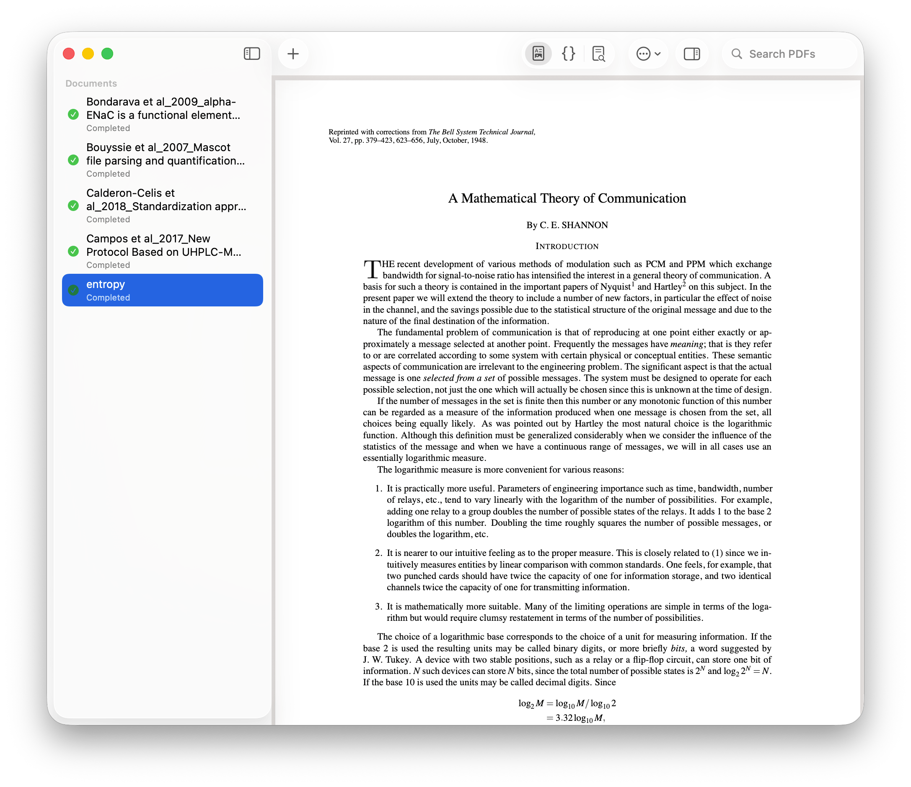
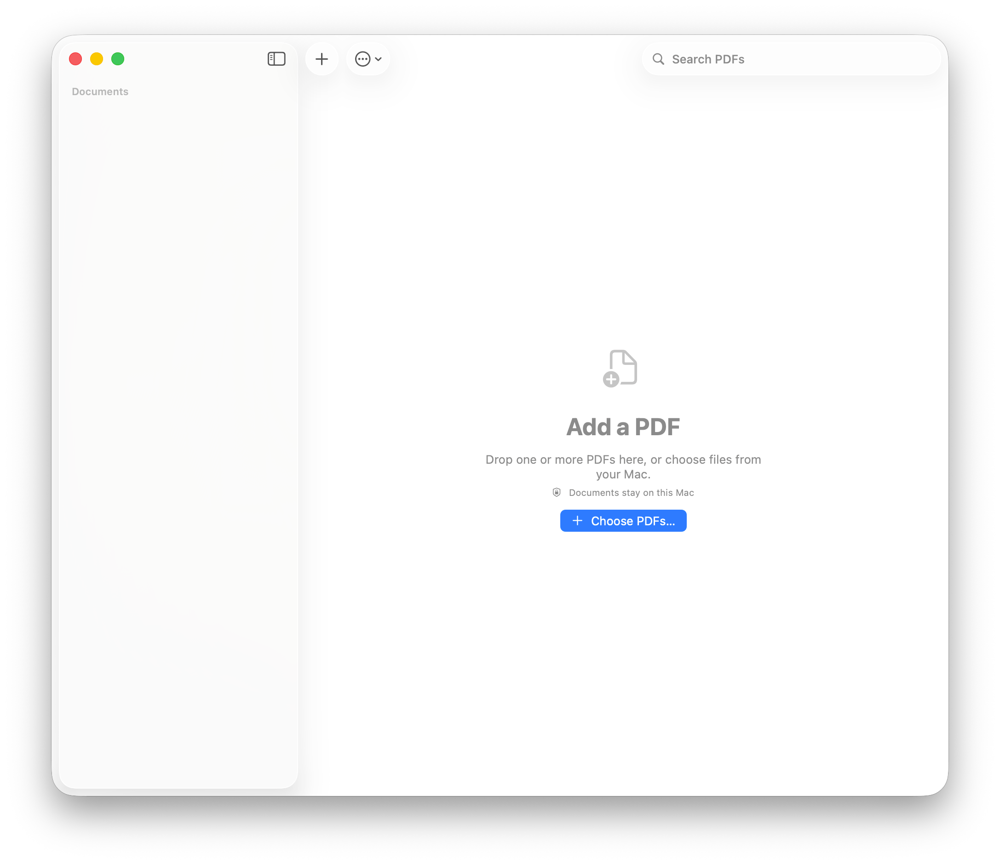
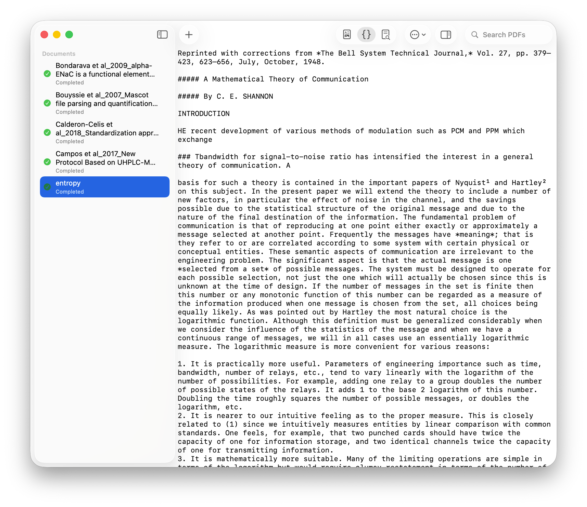
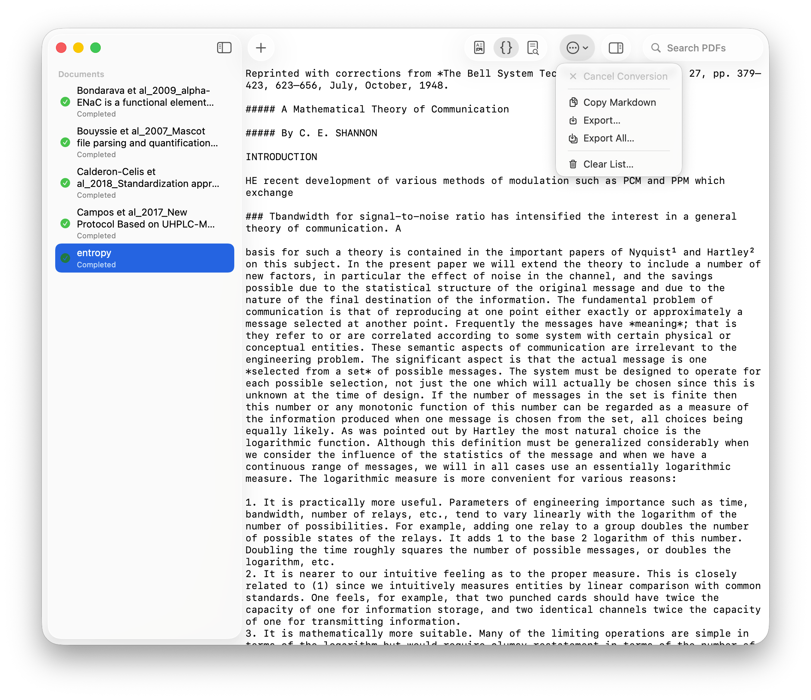

  

<h1 align="center">Parchley</h1>

Turn PDFs into editable Markdown without sending your documents anywhere.

  <a href="https://github.com/SidhuK/Parchley/releases/latest">Download</a>
  &nbsp;·&nbsp;
  <a href="https://discord.com/invite/cNqrBfFx7D">Join Discord</a>
  &nbsp;·&nbsp;
  <a href="https://x.com/karat_sidhu">Follow on X</a>

  
  
  

Parchley is a free, open-source Mac app for turning PDFs into Markdown. Add one file or a whole batch. Parchley converts them in order, then gives you the original PDF, editable Markdown, and a rendered preview in one window.

Everything runs on your Mac. Scanned pages use the included OCR model, and document contents never leave your computer.

## What you can do

- Drop in one PDF or queue several at once.
- Review the original beside the converted text.
- Edit Markdown before saving it.
- Preview the finished document as you work.
- Copy one result or export a whole batch.
- Reopen saved drafts and recent conversions.

## Get Parchley

Parchley requires macOS 26 or later on an Apple silicon Mac.

Download the latest signed and notarized build from the [Releases page](https://github.com/SidhuK/Parchley/releases/latest). Unzip it, then move Parchley to your Applications folder.

Parchley is early software. If a PDF converts badly or the app crashes, [open an issue](https://github.com/SidhuK/Parchley/issues) and include the smallest file that reproduces the problem when you can share it safely.

## How it works

1. Add PDFs with the toolbar button or drag them into the window.
2. Parchley starts converting immediately and works through the queue one file at a time.
3. Review, edit, copy, or export the Markdown.

| Add PDFs | Edit Markdown |
| --- | --- |
|  |  |

| Preview the original | Export results |
| --- | --- |
|  |  |

## Privacy

Parchley does not need an account. It processes PDFs, OCR, drafts, and exports locally. Read the [privacy policy](PRIVACY.md) for storage and cleanup details.

## Build or contribute

Want to build Parchley yourself or understand how it works? Read the [technical guide](TECHNICAL.md). The [contributing guide](CONTRIBUTING.md) covers development setup and pull requests.

The source for the Parchley marketing site lives in [`Website/`](Website/).

## Support

Found a bug or have an idea? [Open an issue](https://github.com/SidhuK/Parchley/issues) or [join the Discord](https://discord.com/invite/cNqrBfFx7D). Report security problems privately through [GitHub Security Advisories](https://github.com/SidhuK/Parchley/security/advisories/new).

## License

Parchley is free and open-source software under the [MIT License](LICENSE). Third-party notices are in [`LICENSES/`](LICENSES/).

  Made by <a href="https://x.com/karat_sidhu">Karat Sidhu</a>

